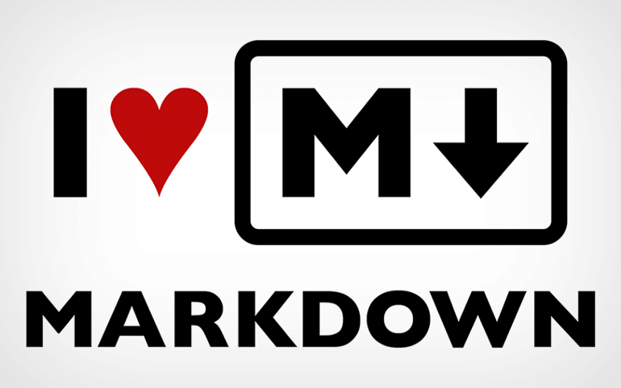

# Markdown Links



# Markdown Links

## Índice

[1. Prefácio](#1-prefácio)
[2. Funcionalidade](#2-funcionalidade)
[3. Instalação](#3-instalação)
[4. Considerações técnicas](#4-considerações-técnicas)

## 1.Prefácio

O markdown links é uma biblioteca que lê arquivos no formato markdown(.md) e retorna os links encontrados neles.

## 2.Funcionalidade

A biblioteca quando requisitada, necessita dos parâmetros:

-Path: Rota da pasta ou arquivo de necessita fazer a busca). -`Validate`:(Opcional) Para verificar o status de cada link -`Stats`: (Opcional) Para verificar as estatísticas dos dados.
Também pode-se combinar os parâmetros `Validate` e `Stats` para acrescentar nas estatísticas os dados do status da validação.

### CLI

A biblioteca pode ser utilizada com linha de comando através do terminal, onde `options` pode ser:
--`stats` ou -s
--`validate` ou -v

Exemplos:

`md-links <path-to-file> [options]`

```sh
$ md-links ./some/example.md
./some/example.md http://algo.com/2/3/ Link de algo
./some/example.md https://outra-coisa-.net/algum-doc.html algum doc
./some/example.md http://google.com/ Google
```

##### `--validate` ou `-v`

```sh
$ md-links ./some/example.md --validate
./some/example.md http://algo.com/2/3/ ok 200 Link de algo
./some/example.md https://outra-coisa-.net/algum-doc.html fail 404 algum doc
./some/example.md http://google.com/ ok 301 Google
```

##### `--stats` ou `-s`

```sh
$ md-links ./some/example.md --stats
Total: 3
Unique: 3
```

##### `--stats` ou `-s` e `--validate` ou `-v`

```sh
$ md-links ./some/example.md -s -v
Total: 3
Unique: 3
Broken: 1
```

### Scripts no Node-js

O modulo pode ser importado para ser utilizado em scripts do Node-js através de uma requisição.

Exemplos:

```js
const mdLinks = require("md-links");

mdLinks("./some/example.md")
  .then((links) => {
    // => [{ href, text, file }]
  })
  .catch(console.error);
```

##### `--validate` ou `-v`

```js
const mdLinks = require("md-links");

mdLinks("./some/example.md", { validate: true })
  .then((links) => {
    // => [{ href, text, file, status, ok }]
  })
  .catch(console.error);
```

##### `--stats` ou `-s`

```js
const mdLinks = require("md-links");

mdLinks("./some/example.md", { stats: true })
  .then((links) => {
    // => { Total: 4, Unique: 2 }
  })
  .catch(console.error);
```

##### `--stats` ou `-s` e `--validate` ou `-v`

```js
const mdLinks = require("md-links");

mdLinks("./some/example.md", { validate: true, stats: true })
  .then((links) => {
    // => { Total: 4, Unique: 2, Broken:1 }
  })
  .catch(console.error);
```

## 3.Instalação

_Para a instalação da biblioteca é necessário possuir o [Nodejs](https://nodejs.org/en/) e o [NPM](https://www.npmjs.com/) instalados no seu computador._

Para instalação global, execute no terminal:

```sh
npm -i -g gabrielapiovezan/SAP004-md-links
```

Para instalação local, execute no terminal

```sh
npm -i  gabrielapiovezan/SAP004-md-links
```

## 4.Considerações Técnicas

Para a construção da biblioteca foi utilizado o Node-JS através do software Visual Studio Code com o gerenciador de pacotes NPM.
A linguagem de programação utilizada foi o
JavaScript.
Foram utilizadas as seguintes extensões: -[Jest](https://jestjs.io/), para testes síncronos e assíncronos do arquivo raiz. -[Node-Fetch](https://www.npmjs.com/package/node-fetch), Para validação dos links. -[Commander], para implementação da CLI.
